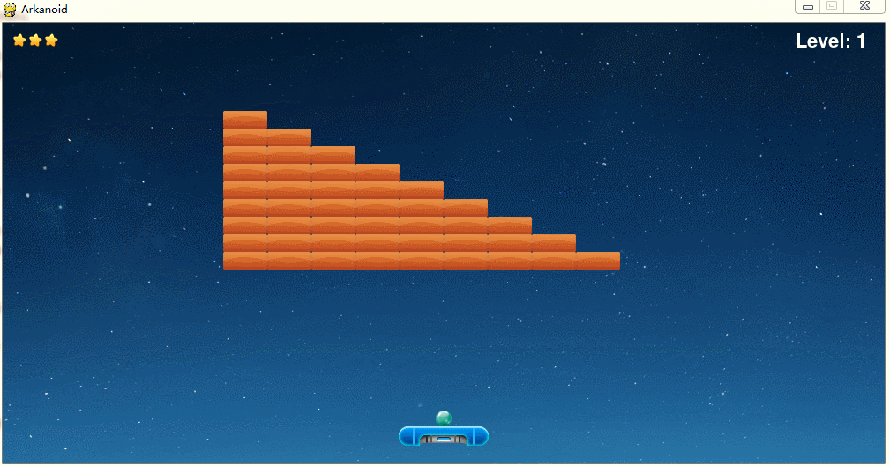
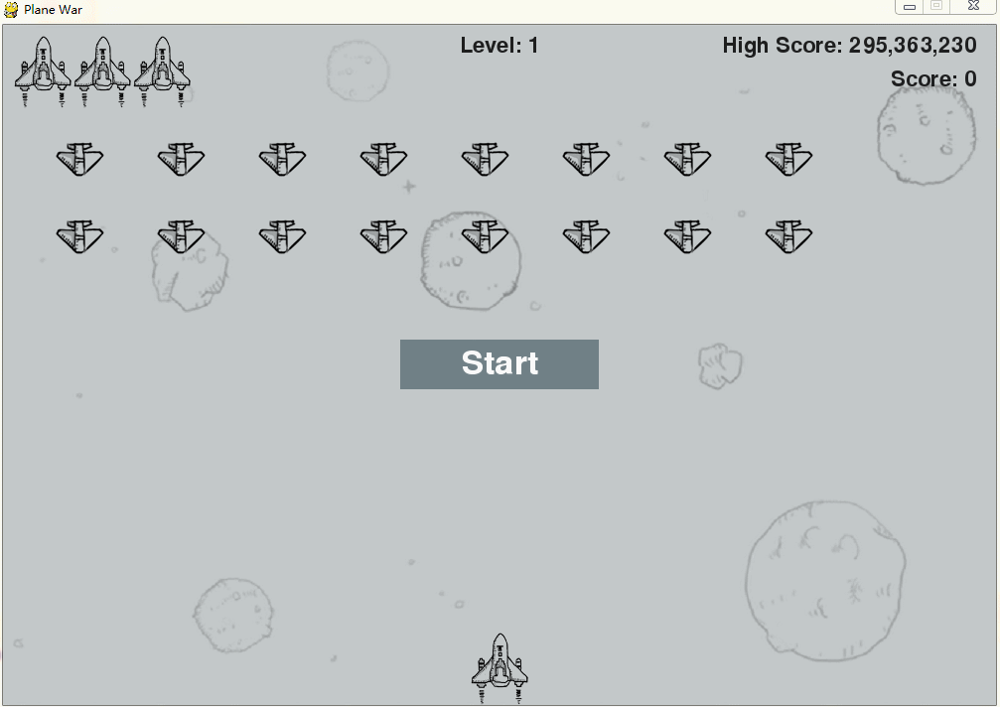

# Pygame-Practice

## 打砖块

1. 左右箭头移动挡板
2. 按 Space 键发射弹球
3. 按 Q 或 右上角的叉 退出游戏

## 飞机大战

1. 左右箭头移动战斗机
2. 按 Space 键发射子弹
3. 按 Q 或 右上角的叉 退出游戏

## 关于 pygame 的一些小练习

* 仿照window中画图的截取拖动功能
* 弹性球
* 单个弹性变化的矩形
* 单条弹性变化的线段
* 多个弹性变化的矩形
* 多条弹性变化的线段
* 连续不间断的线段